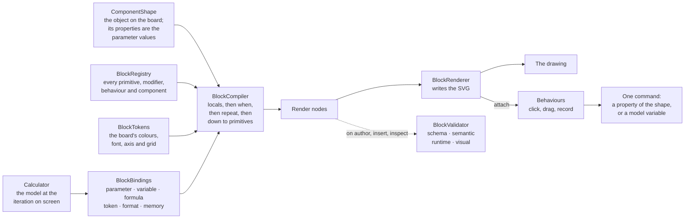
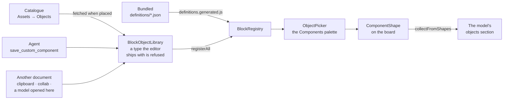

# Building blocks — developer guide

How Modellus objects are composed from reusable blocks, how to add new ones, and the rules
the AI agent plays by. See [`object-blueprint.md`](object-blueprint.md) for the template a new
object is written from, [`building-blocks-assessment.md`](building-blocks-assessment.md)
for why the architecture looks like this, [`building-blocks-catalogue.md`](building-blocks-catalogue.md)
for the block list, and [`migration-plan.md`](migration-plan.md) for the remaining shapes.

## 1. Architecture

Five layers, one registry, no runtime code evaluation.

```
Primitives   circle, rect, ellipse, line, polyline, polygon, arc, ring, path, text, image, group
Modifiers    translate, rotate, scale, mirror, opacity, visibility, stroke, fill, z-order, repeat
Behaviours   selectable, draggable, resizable, rotatable, hoverable, tooltip, drag-angle,
             drag-rotate, drag-axis-tick, follow-pointer, clickable, remember, forget,
             track-pointer, …
Bindings     constant | parameter | variable | expression | formula | token | format | memory
Components   dial-face, tick-ring, label-ring, pointer-hand, pointer-ring, plot-grid, plot-axes,
             plot-crosshair, memory-list, memory-trace, analogue-clock, compass, speedometer,
             circular-gauge, rotating-vector, orbit-system, steering-wheel, calculator,
             mouse-tracker, + custom components
```

### How a drawing is made

The spine is the same for every object on the board: the shape holds the parameter values, the
compiler turns them into nodes, the renderer writes them once. Everything above the spine is a
source the compiler reads, and the only thing that flows backwards is an interaction.



Nothing else can draw: a type the registry does not hold is refused by both the compiler and the
validator. The loop closes through the next frame — an interaction writes one command, and what it
wrote is read back the next time the object compiles, which is why a whole drag is a single undo
entry and why nothing on the board has a redraw path of its own.

### Where a definition comes from

The registry does not care which way an object arrived, which is why one invented by the agent, one
placed from the catalogue and one the editor ships with all behave identically.



The last box is the first one again: what a board writes into the model's objects section is what
arrives as *another document* when that model is opened somewhere else. That is the whole reason the
section exists — an object the editor does not ship with has to travel with the model that uses it.

Files (all plain globals, loaded by `<script>` in `pages/board/index.html` and
`pages/board/board-offline.html`, in this order):

| File | Global | Role |
| --- | --- | --- |
| `scripts/blocks/designTokens.js` | `BlockTokens` | the board's visual language: colours, font, axis, grid, crosshair, and the five presets |
| `scripts/blocks/blockGeometry.js` | `BlockGeometry` | polar points, arcs, rings, tick rings, needles |
| `scripts/blocks/blockMemory.js` | `BlockMemory` | the rows an object remembers, and the columns they make |
| `scripts/blocks/blockBindings.js` | `BlockBindings` | declarative value resolution |
| `scripts/blocks/blockRegistry.js` | `BlockRegistry` | the one catalogue |
| `scripts/blocks/blockPrimitives.js` | — | primitive registrations |
| `scripts/blocks/blockModifiers.js` | `BlockModifiers` | modifier registrations |
| `scripts/blocks/blockBehaviours.js` | `BlockBehaviours` | behaviour registrations |
| `scripts/blocks/blockMigrations.js` | `BlockMigrations` | schema versions and migrations |
| `scripts/blocks/blockCompiler.js` | `BlockCompiler` | definition → render nodes |
| `scripts/blocks/blockRenderer.js` | `BlockRenderer` | render nodes → SVG |
| `scripts/blocks/blockValidator.js` | `BlockValidator` | schema/semantic/runtime/visual validation |
| `scripts/blocks/blockSvgImport.js` | `BlockSvgImport` | turns a drawing into blocks: SVG in, primitive nodes out |
| `scripts/blocks/blockComponents.js` | `BlockComponentHelpers` | component registrations |
| `scripts/controls/AxisTickDrag.js` | — | the axis toolkit every axis on the board is built from: nice ticks, minor ticks, tick labels, tick dragging |
| `scripts/controls/AxisRangeControl.js` | `AxisRangeControl` | the one editor for how far an axis runs |
| `scripts/blocks/blockChartGeometry.js` | `BlockChartGeometry` | scales, series points, area/line paths, bar layout |
| `scripts/blocks/blockMemoryComponents.js` | — | the list and the trace a memory is read back as |
| `scripts/blocks/blockChartComponents.js` | — | the chart components |
| `scripts/blocks/blockObjectLibrary.js` | `BlockObjectLibrary` | the objects a model carries with it |
| `scripts/blocks/blockObjectCatalogue.js` | `BlockObjectCatalogue` | the objects the catalogue offers |
| `scripts/catalog/objectDrawing.js` | `ObjectDrawing` | compiles an object and photographs it |
| `scripts/catalog/objectSeeder.js` | `ObjectSeeder` | publishes the bundled objects to the catalogue |
| `scripts/blocks/blockObjects.js` | `BlockObjects` | object definitions and component instances |
| `scripts/blocks/blockAgentTools.js` | `BlockAgentTools` | the agent-safe tool surface |
| `scripts/calculator.js` | `Calculator` | the model, and the one place the values it runs on are held |
| `scripts/editors/board/widgets/ComponentWidget.js` | `ComponentShape` | the host shape |
| `scripts/shapes/componentShape/ComponentShapeToolbar.js` | — | its property editor |
| `scripts/shapes/shared/characterPicker.js` | `CharacterLibrary`, `CharacterPickerMixin` | the characters a shape can wear, and the popup that picks one |
| `scripts/toolbars/objectPicker.js` | `ObjectPicker` | the object palette: previews, descriptions, search |
| `scripts/controls/BlockChartControl.js` | `BlockChartControl` | the chart control that paints through blocks |
| `scripts/shapes/blockChartShape/BlockChartShape.js` | `BlockChartShape` | the chart shape built on blocks |

## 2. The object definition

```js
{
    schemaVersion: "1.0.0",
    id: "…",
    type: "analogue-clock",
    name: "Clock",
    preset: "standard",
    root: <node>,
    parameters: [ <ParameterDefinition> ],
    metadata: { source, createdAt, request, blocksUsed, edited }
}
```

A node is one of:

```js
{ id, type: "<primitive>", properties: {…}, bindings: {…}, modifiers: [...], behaviours: [...], children: [...] }
{ id, type: "<component>", parameters: {…}, modifiers: [...], behaviours: [...] }
```

`properties` are constants, `bindings` are declarative values for the same property names;
a binding always wins over a constant. Only `group` accepts `children`.

**Parameter values of an object live in `shape.properties`**, not inside the definition.
`BlockObjects.createComponentInstance()` writes `parameters: { radius: { parameter: "radius" }, … }`
into the root node, and the shape passes its own `properties` as the compilation parameters.
That is what makes components work with the existing property editor, undo/redo, copy/paste,
collaboration and serialization without any special cases.

## 3. Defining a primitive

```js
BlockRegistry.register({
    type: "circle",
    category: "primitive",
    displayName: "Circle",
    description: "Circle defined by a centre point and a radius.",
    tags: ["shape", "round"],
    capabilities: ["fillable", "strokable", "radial"],
    inputSchema: BlockPrimitiveSchemas.withStyle({
        centerX: { valueType: "number", defaultValue: 0, label: "Centre X" },
        centerY: { valueType: "number", defaultValue: 0, label: "Centre Y" },
        radius: { valueType: "number", defaultValue: 40, minimum: 0, label: "Radius" }
    }),
    render: properties => ({ tag: "circle", attributes: { cx: properties.centerX, cy: properties.centerY, r: properties.radius } })
});
```

`render` receives fully resolved, coerced and clamped values and returns `{ tag, attributes, text? }`.
It must be pure: no DOM, no globals, no time, no randomness. Add `validate(input, context)`
when a value needs a rule the schema cannot express (see `path` and `image`).

## 4. Defining a modifier

```js
BlockRegistry.register({
    type: "rotate",
    category: "modifier",
    inputSchema: { properties: { angle: {...}, centerX: {...}, centerY: {...} } },
    apply: (input, accumulator) => {
        accumulator.transforms.push(`rotate(${input.angle} ${input.centerX} ${input.centerY})`);
        return accumulator;
    }
});
```

The accumulator is `{ transforms: [], style: {}, visible: true, order: 0 }`. `repeat` is the
one structural modifier: the compiler expands it before anything else and exposes `$index`
and `$count` as parameters to bindings inside the repeated subtree.

## 5. Defining a behaviour

```js
BlockRegistry.register({
    type: "tooltip",
    category: "behaviour",
    inputSchema: { properties: { text: { valueType: "string", defaultValue: "" } } },
    attach: (host, element, input) => { … }
});
```

A behaviour with an `attach` function is applied by `BlockRenderer` right after the SVG is
written. A behaviour without one is handled by the host shape
(`ComponentShape.attachBlockBehaviour`) — that is where `drag-angle`, `drag-rotate` and
`clickable` live, because they need the board, the calculator and the shape's coordinate system.
`selectable`, `draggable`, `resizable` and `rotatable` are registered for discovery only:
every component gets them from `BaseShape`.

## 6. Defining a component

```js
BlockRegistry.register({
    type: "analogue-clock",
    category: "component",
    icon: "fa-light fa-clock",
    tags: ["object", "clock"],
    parameters: [ BlockComponentHelpers.parameter("hourVariable", "Hour variable", "variable", "0", { category: "model" }), … ],
    create: (parameters, context) => ({ id: "analogue-clock", type: "group", children: [ … ] })
});
```

`create` returns **a node tree, not markup**. It runs on every compile, so it may read live
values through the context helpers:

* `context.resolveTermValue(nameOrNumber, fallback)` — a model variable or a numeric literal.
* `context.resolveNumber(binding, fallback)` / `resolve` / `resolveText` — any binding.
* `context.tokens` — the active `BlockTokens`.
* `parameters.$width`, `parameters.$height` — the object's box, so components scale on resize.

Give a component the tag `object` if it should appear in the board's Components palette;
low-level components (`dial-face`, `tick-ring`, `label-ring`, `pointer-hand`, `pointer-ring`)
deliberately do not have it.

### Components defined as JSON

A component that only composes other blocks does not need a `create` function at all. It is a
JSON document in `scripts/blocks/definitions/`, registered by `BlockDefinitionLoader`. Every
component in the Components palette — analogue clock, compass, speedometer, circular gauge,
rotating vector, orbit system — is defined this way. Only `dial-face`, `tick-ring`, `label-ring`,
`pointer-hand` and `pointer-ring` stay in code, because they generate geometry per index rather
than compose.

```json
{
    "schemaVersion": "1.0.0", "type": "compass", "category": "component",
    "parameters": [ { "id": "headingVariable", "valueType": "variable", "defaultValue": "0", "category": "model" } ],
    "locals": [
        { "id": "w", "value": { "parameter": "$width" } },
        { "id": "r", "formula": "\\max\\left(4,\\frac{\\min\\left(w,h\\right)}{2}-6\\right)" },
        { "id": "needleLength", "formula": "r\\cdot0.66" }
    ],
    "root": { "id": "compass", "type": "group", "children": [
        { "id": "needle", "type": "pointer-hand", "when": { "parameter": "showNeedle" },
          "parameters": { "length": { "parameter": "needleLength" } } }
    ] }
}
```

* **`locals`** are derived values, evaluated in order onto the component's parameter frame before
  the tree is compiled. Each may read the parameters and any earlier local, so a value the whole
  tree needs is worked out once. A formula reads bare names and the loader wires the inputs at
  registration time, not per draw.
* **Nothing is implicit.** A formula may only read what the document declares — reach the drawing
  size by declaring a local bound to `$width` or `$height`. A name that is neither declared nor
  listed in an explicit `inputs` block is rejected at registration, because it would otherwise
  fall through to a model term of that name.
* **`when`** on a child drops it before compilation when the binding is false, so a hidden part
  costs nothing and does not shift the ids of its siblings.
* **`choose`** is a binding kind for values that are not numbers: `{ "choose": …, "then": …,
  "otherwise": … }`, used for the clock's drag variables. A zero and a blank string are false,
  which is how the gauges guard a zero range and a missing unit without a comparison operator.
  Adding **`equals`** turns the truth test into a comparison — `{ "choose": { "parameter":
  "wheelType" }, "equals": "boat", … }` — which is what a parameter offering a set of named
  alternatives needs; the steering wheel picks which of its three drawings is compiled that way.
* **`concat`** joins resolved parts into one string, so the gauge readouts build
  `"64 km/h"` from a `format` binding and their own `unit` parameter. `format` resolves its
  `digits`, `prefix` and `suffix` as bindings too.
* **`art`** names the drawing files a definition's imported nodes came from, so a redrawn file can be
  imported again over the same document. It is provenance only — nothing reads it at runtime, and the
  nodes it produced are in `root` like any others.
* **`preview`** holds the parameter values the object picker draws its thumbnail with:
  `{ "preview": { "parameters": { "valueVariable": "64", "unit": "km/h" } } }`. It is not part of
  the object — nothing else reads it — and the defaults are used when a document omits it. An
  object whose defaults draw nothing recognisable (a phasor of length one, a gauge reading zero)
  needs it; a clock does not.

The JSON files are the source of truth. The browser cannot `fetch` them in the offline build,
which runs from `file://`, so they are delivered by `definitions.generated.js`; regenerate it
with `UPDATE_DEFINITIONS=1 npx playwright test tests/component-definitions.spec.js`, which
otherwise fails when the bundle and the JSON have drifted.

### Drawings imported from SVG

Some objects are illustration rather than arithmetic — a compass rose, a body, an instrument face.
Composing one from primitives by hand is the wrong tool: it belongs in a drawing program.
`BlockSvgImport.import(markup)` takes SVG and returns **primitive nodes**, which are then part of the
definition like any others.

It converts, it does not embed. Nothing about the runtime changes: no new node type, no markup
reaching `BlockRenderer`, nothing for the compiler, the validator or the serializer to learn. That is
also the security boundary — [`toMarkup()`](../../scripts/blocks/blockRenderer.js) builds every tag
itself and escapes every value, and a definition travels through the model file, the clipboard, a
collaboration op, the catalogue and the agent. An imported drawing arrives as data that has already
been through the allow-list; a string of SVG would arrive as a drawing nobody had read.

```js
const imported = BlockSvgImport.import(markup);       // { nodes, viewBox, count, problems, mapped, unmapped }
const merged = BlockSvgImport.merge(previousNodes, imported.nodes);
```

* **Converted**: `svg`, `g`, `circle`, `ellipse`, `rect`, `line`, `polyline`, `polygon`, `path`,
  `text`, `image`, with fill, stroke, width, dash, linecap, opacity and visibility read from either
  the attribute or the inline `style`. `transform` becomes `translate`, `rotate` and `scale`
  modifiers; `matrix()` and `skew()` are reported rather than approximated.
* **Refused, and reported**: `script`, `style`, `foreignObject`, animation elements, `on*` handlers,
  links, image sources outside the `image` primitive's allow-list, and path data outside the path
  grammar. Nothing is dropped silently — every refusal is a line in `problems`.
* **Unsupported, and reported**: `use`, `defs`, gradients, masks, filters, clip paths. A drawing that
  leans on them imports into something that differs from the file, which the author has to know.
* **Colours become tokens.** A fill matching a token in the standard preset is written as
  `token:surface.default` rather than `#ffffff`, preferring the family that suits the property — text
  fills look for `text.*`, strokes for `stroke.*`. That is what keeps an imported object following the
  presets like a hand-written one. What could not be matched is listed in `unmapped`.
* **Ids are the contract.** An id in the file is the id of the node, so the definition attaches
  `bindings`, `modifiers`, `behaviours` and `when` to the parts it names. Everything else gets a
  generated id.
* **Re-import keeps the wiring.** `merge()` takes the geometry from the new import and the wiring from
  the old nodes, matched by id, so a redrawn file does not cost the bindings. It reports what it
  `kept` and what it `lost` — wiring whose id the new drawing no longer has. Modifiers are only
  carried over when they hold a binding, which is what separates one an author added from one a
  `transform` produced.

**Interaction is in the object's pixels, not the drawing's.** `getComponentLocalPoint()` answers in
the shape's own box, so a node carrying `drag-angle`, `drag-rotate`, `track-pointer` or
`follow-pointer` has to be expressed there — outside the group that scales the art. The compass puts
its two grab areas beside the art rather than inside it for exactly this reason.

**A grab selects the object it belongs to.** A grab area answers the pointer before the board does
and holds it for the whole drag, so pressing one would otherwise leave the object unselected and its
toolbar hidden until the pointer came up — and an object whose face is nearly all grab area, as the
steering wheel's is, would feel as though it could not be picked at all. `drag-angle` and
`drag-rotate` select on the way in, and so does the grab that refuses to write, which is inert but
still stands between the pointer and the board.

**Import illustration, not measurement.** Art is authored at one size and has one layout: it cannot
put ticks on round numbers, keep a label legible when the object is small, or move one part to make
room for another. Those stay components — which is why the compass is imported art for its face, its
needle and the one tick a `repeat` puts around the rim, and `label-ring` for the cardinal and degree
labels: they have to stay legible at 80px and move apart when the degrees are shown.

### The look is not the object's to invent

An object drawn from blocks has to look like the board it stands on, and the board already has a
look: it writes in `Katex_Main`, its axes are `#7a7a7a` at 1.2, its tick marks are 4 long with the
number 1.8 font sizes below in `#666666`, its grid is `#d3d3d3`, its crosshair is dashed `4 3` at a
quarter opacity and its values are read on a rounded plate at 0.85. Those are `ChartControl`'s own
option defaults, so an object drawing against a scale is the same grey as a chart beside it. Those numbers are the design tokens.
`Utils.valueBadgeSvgMarkup` and `Utils.crosshairLineSvgMarkup` — what the hand-written shapes draw
with — read them from `BlockTokens` too, so there is one place a value lives and no second copy to
drift. The gaps around a tick label are multiples of the tick font rather than pixel counts, so a
200px object's labels sit as close to its axis as a full-sized chart's do.

Two rules follow, and together they mean **no definition ever names a font or an axis colour**:

* A **default may be a token reference**: `"defaultValue": "token:font.family"`. The compiler reads
  it through the tokens wherever a default is used — as the value, and as what a failed binding
  falls back to. The `text` primitive defaults its family, size and weight this way, which is why
  changing a preset restyles every object at once.
* **Anything cartesian is a component, not a drawing.** `plot-grid`, `plot-axes` and
  `plot-crosshair` take a box (`x`, `y`, `width`, `height`), the range shown in it
  (`minimumX`…`maximumY`) and a target tick count, and draw the board's own axis. The mouse tracker
  is nothing but those three over a `memory-trace`; before them it drew its own lines and labels,
  and looked it.

An axis drawn this way is the chart's axis, down to the arithmetic — all of it comes from
`AxisTickDrag.js`, the file the ruler and the referential already shared:

* **The ticks land on round numbers.** `buildNiceTickValues` picks the step, so a count is a target
  rather than a division of whatever the range happens to be, and `formatAxisTickValue` writes the
  number under it — which is why an axis needs no decimals setting.
* **Each interval is subdivided** as far as `minorTickDivisions` says the minor ticks can be told
  apart, drawn short and faint against the axis and faint again across the grid.
* **A tick is a handle.** An axis that names the properties holding its ends
  (`minimumXProperty`, `maximumXProperty`, …) gets a grab area over every numbered tick carrying the
  `drag-axis-tick` behaviour: pulling one holds the near end still and moves the far one, writing the
  object's own maximum. It is the chart's interaction and the chart's formula — `AxisTickDrag`,
  `newScale = |tickOffsetValue / pixelOffset|` — and the whole drag is one undo step.

`plot-crosshair` answers a pointer the way the chart's crosshair answers a hovered x: both dashed
lines cross the whole plot, the pointer's own place is read as a pair on a badge under it, and the
point nearest that horizontal value — from the rows the component is handed — is marked and read off
both axes, its height on the left in the colour of the run it belongs to and its own horizontal value
on the axis below. Every one of those readouts is rounded to `$precision`, the reserved parameter
carrying the decimals the model is read to, so a value beside a drawing reads the way the same value
reads everywhere else on the board.

**What the pointer is over is not something the object keeps.** `follow-pointer` reports where the
pointer is, in the units the node is scaled in, into parameters the definition names — and the host
hands those values to the next compilation rather than writing them to the shape, so hovering leaves
no edit, no undo entry and no changed file. It answers only while the model stands still: `$playing`
is a reserved parameter beside `$iteration`, and a drawing that follows the pointer stops doing so
the moment the player starts, because what it shows then is the iteration everything else is showing.
The mouse tracker's crosshair and marker work exactly this way.

**What a shape can be taken back to lives under the bin.** `getRemoveMenuItems()` on the base toolbar
offers remove and reset; an object holding a memory adds clear, which empties it and takes it out of
the model. Neither the tracker nor the calculator draws a clear key of its own any more, and the
bin's tooltip names all three.

The **ends of an axis are edited by one control** wherever they appear. `AxisRangeControl` draws a
minimum and a maximum side by side, with whatever else that axis needs after them, and is told only
how to read a bound and how to write one: the chart writes its domain override, the referential
turns the bound back into an origin and a scale, an object built from blocks writes two of its own
parameters. A component that declares `minimumX`/`maximumX`/`minimumY`/`maximumY` gets those two
rows in its settings menu instead of four separate number boxes, with no code of its own.

It can also declare **`autoScale`** and **`equalScales`**, the chart's own two switches, and gets the
chart's own behaviour: auto scale fits both axes to what the object is holding, padded by
`BlockChartGeometry.padDomain` — the margins the chart pads its data with — and equal scale widens
whichever axis needs it through `equalizeDomain`, the function the chart itself calls, measured on
the box the object names `plot`. What they work out is handed to the drawing and shown in the number
boxes, disabled, and is never written down: the ends the object was set to survive the switch being
turned off again. An axis the object is deciding for itself is not an axis to drag, so its tick
handles are not drawn.

**Colours are named once too.** `BaseShapeToolbarMixin.plotColorMenuItems` maps `backgroundColor`,
`dataAreaColor` and `axisColor` to the label and icon they are offered under, and `pushColorMenuItem`
builds the row. A definition that names its colours those three gets the chart's colour menu exactly —
the mouse tracker does, and paints its grid, labels, trace and marker from them and from the tokens
rather than asking for a colour per part.

### The chart components

`chart` composes `chart-frame`, `chart-grid`, `chart-axes`, `chart-series` and `chart-bars` into a
whole chart. It is the one component family that is not free to work out its own numbers: the plot
box, the domain, the ticks and the data rows arrive as parameters, because the host control needs
the very same numbers for hit testing, the focus markers and the crosshair. Turning them into
pixels is the components' own work, through `BlockChartGeometry`, which the drawn `ChartControl`
also calls — one implementation of the mapping, two ways of painting it.

Three things follow from a chart being a drawing of a whole run rather than a dial:

* **`clip`** is a modifier that clips a node to a clip path the host drawing already declares
  (`{ type: "clip", clipId: "…" }`). The grid and the series are clipped to the plot, the axes to
  the shape, the tick marks to their axis strip. The id is checked against the shape of an id and
  can only ever point inside the document that holds the drawing; it is not agent-accessible.
* **The node limit is per compiler.** `new BlockCompiler(registry, bindings, { maxNodes: 20000 })`
  raises it for one host only — a scatter of a long run legitimately draws a marker per point.
  `BlockCompiler.limits` stays the default for everything else.
* **The chart components are not agent-accessible** and carry no `object` tag, so they stay out of
  the Components palette and out of the agent catalogue: without a host to hand them a plan there
  is nothing for them to draw.

`BlockChartShape` is the host, and it is placed from the board's Components palette beside the
component objects: the palette lists the component types tagged `object` and, after them, the
objects that are built from blocks but are shapes of their own. It inherits every behaviour from `ChartShape` — the same properties,
the same toolbar, the same term collection, the same domain handling, the same drags — and only
swaps the control for `BlockChartControl`, which compiles the `chart` component and writes it with
`BlockRenderer` instead of writing SVG itself. The axis title, the series legend and the area
readout stay with the base control: they are term labels with case icons and an icon glyph over a
measured background, which the primitives do not describe. `tests/block-chart-shape.spec.js` holds
both drawings to the same geometry, tag for tag and coordinate for coordinate.

## 7. Parameters and bindings

A `ParameterDefinition` carries `id`, `label`, `description`, `valueType`
(`number | string | boolean | colour | variable | expression | memory | character | object`),
`defaultValue`, `required`, `minimum`, `maximum`, `enumValues`, `unit`, `category`, `bindable`,
`agentAccessible`, `userEditable`, `structured`. `category` drives where the editor puts it:
`style` goes in the shape/colour menu, `model` and `orbits` in the variables menu, `state` is what
the object keeps for itself and is never editable, everything else goes in the settings menu.
A `character` parameter is edited with the catalogue's character picker, the one a body uses.
A `structured` parameter carries a shape rather than a value — a list of actions, a row template —
and the bindings inside it are resolved along with the ones around it; a parameter that does not
declare it is passed through untouched, so a component handed a long run of data rows is not
searched for bindings that cannot be there.

Bindings:

| Form | Meaning |
| --- | --- |
| `{ constant: 12 }` | a fixed value |
| `{ parameter: "hourVariable" }` | another parameter's value; add `as: "number"` to read it as a model variable |
| `{ variable: "minute", case: 1 }` | a model variable (a numeric literal is accepted too) |
| `{ expression: "minute\\cdot6" }` | a Modellus LaTeX expression over model variables |
| `{ formula: "…", inputs: { m: { variable: "minute" } } }` | an expression whose free names are supplied by other bindings |
| `{ token: "stroke.default" }` | a design token |
| `{ format: <binding>, digits: 1, prefix, suffix }` | a number rendered as text |
| `{ choose: <binding>, equals: <binding>, then: …, otherwise: … }` | a conditional; without `equals` it tests the value for truth, with one it compares them |
| `{ direction: { x: <binding>, y: <binding> } }` | the angle a pair points in — how far across and how far up — in degrees clockwise from straight up |
| `{ memory: "history", row: <binding>, field: "x", from: "end" }` | a memory: the whole list, one row, or one field of it |
| `{ memoryCount: "history" }` | how many rows a memory holds |

Expressions are parsed by `Modellus.Parser` (the same engine that runs the model) into a
`Branch` and evaluated with `branch.calculate(values)`. There is no `eval`, no `new Function`,
and no other executable path anywhere in this layer.

The clock's hands are the reference example:

```
hourHand.rotation   = \left(\mod\left(h,12\right)+\frac{m}{60}\right)\cdot30   h←hour, m←minute
minuteHand.rotation = \mod\left(m,60\right)\cdot6                              m←minute
secondHand.rotation = \mod\left(s,60\right)\cdot6                              s←second
```

## 8. Memory — what an object keeps

Some objects have to hold more than a value. A calculator keeps the operations it has completed; a
tracker keeps where the pointer went. A **memory** is an ordered list of rows an object writes as it
is used and reads back when it draws — and it is not a new kind of storage. It is a parameter whose
`valueType` is `memory`, so it lives in `shape.properties` beside the numbers, which is what makes
the model carry it, undo restore it, the clipboard take it and collaboration send it with nothing
added anywhere for the purpose.

A row carries a label and a point — `{ text, x, y }` — and writes only the fields it holds, because
a missing field reads back as empty or as zero, exactly what it would have been written as. A
calculator history row is `{ text: "12 + 5", x: 17 }`; a tracker sample is `{ x: 3.4, y: 7.1 }`.

### A memory that names terms is measurements

A memory parameter may declare **`termParameters`**, which maps its fields to the parameters holding
the names of the model terms they feed:

```json
{ "id": "samples", "valueType": "memory", "termParameters": { "x": "xVariable", "y": "yVariable" } }
```

When those parameters name variables, the rows stop being only a drawing's private notes: **row n is
iteration n** of those terms, the same thing a data table's rows are, and the model runs on them.
A chart of `px` draws the recording, a body bound to it walks the recording, and the board's own
player replays it, because there is nothing to replay separately — the model's timeline is the
recording's timeline. A memory that names nothing stays with the object and feeds the model nothing.

The values are held **centrally, by the `Calculator`**, on the same path measurements take:

| Call | Role |
| --- | --- |
| `setDataSource(sourceId, names, values)` | registers one set of values under the id of whatever owns it |
| `removeDataSource(sourceId)` | takes it away again |
| `applyDataSources()` | merges every registered set into the one preloaded table the engine reads |
| `loadExternalData` / `refreshExternalData` | what a data table calls; they are `setDataSource` with the engine reset that follows an edit |

Merging is what makes several of them possible at once: the columns are the union of the sources',
the table is as long as the longest, and the rows a shorter source does not reach are left blank —
which is what a data table with an empty cell already means. Before this, a second set of values
quietly replaced the first.

`ComponentShape` is what registers an object's memories: `publishModelData()` writes them into the
calculator, `refreshModelData()` does that and then works the model through, and `BaseShape` carries
an empty `publishModelData()` so `BoardEditor.reset()` can ask every shape for its values right after
the model has been cleared — beside the loop that reloads the data tables. A column is left out when
the model works that name out for itself, so a recording can never overwrite an answer the model owns.

### Writing and reading a memory

Three behaviours write one, and the host shape attaches all three, because they need the board, the
model and the shape's coordinate system the way `clickable` and `drag-angle` do:

| Behaviour | What it does |
| --- | --- |
| `remember` | appends a row when the node is clicked. The label and both numbers are bindings, so a key records what the object held at the moment it was pressed |
| `forget` | empties a memory |
| `track-pointer` | records the pointer while it is dragged over the node, one sample every `sampleMs`, converted through the node's own origin and scale so what is stored is a pair of values rather than a pair of pixels. Nothing is recorded until the pointer travels — a click that never moves writes nothing and opens no edit, so undo is never given a step that takes nothing back — and a drag opens its run at the point the pointer went down. `minimumMovePixels` says how far it must have travelled since the last sample for the clock to take another: left at zero a pause inside a drag is recorded as a pause, above it a pointer resting adds nothing where it rests. `breakOnDrag` writes a break in front of each drag, so every one of them is a run of its own |

Two bindings and two components read one back:

```json
{ "memory": "history" }                                                 the whole list
{ "memory": "history", "row": { "parameter": "head" }, "field": "x" }   one field of one row
{ "memory": "samples", "row": 0, "from": "end" }                        the newest row
{ "memoryCount": "history" }                                            how many rows there are
```

`memory-list` draws the rows as a list, newest first, label left and number right — or stacked, which
is what a narrow column needs — and gives each row the actions its `rowActions` parameter declares:
`{ property, field }` writes one of the row's own numbers, `{ property, value }` a fixed one, which is
how choosing a line of the calculator's history puts that result back on the display. `memory-trace`
draws the path the rows describe, mapped through the same origin and scale the recording used. Both
generate geometry per row rather than compose other blocks, which is why they are code components
rather than JSON documents.

A row may instead be a **break**: `{ "gap": 1 }`, holding no point, written by `BlockMemory.createGapRow()`
and read by `BlockMemory.isGap()`. `memory-trace` ends one line at a break and opens the next after
it, so runs recorded separately are drawn separately, and `toTermSeries` gives the model `NaN` for
that row — one iteration with nothing measured at it, which is what a data table's empty cell already
means. NaN is not what is stored: a memory is saved as JSON, where `NaN` is written as `null` and
would come back as a zero, a point at the origin nobody put there. Whatever reads the points of a
memory has to know about it — the trace, the fit an object's auto scale works out, and the point a
crosshair answers the pointer with all leave breaks out.

Three rules bound what a memory can cost: a memory holds at most `BlockMemory.maxRows` (2 000) rows,
each writing behaviour carries its own `limit` and drops the oldest row past it, and stored numbers
are rounded to six decimals. A recording is one edit — the drag opens with `dragStart()` and closes
with `dragEnd()`, so a whole run is a single undo entry and a single collaboration op rather than one
per sample, and the model is worked through once, when the pointer comes up.

A behaviour may carry a **`when`**, resolved like a child's: a behaviour whose condition is false is
not attached. That is how the calculator's equals key records a completed operation and records
nothing when there is no operation to complete, without the key itself disappearing.

The two objects built on this are the reference examples:

* **`calculator`** keeps `history`, which names no terms: the working is the object's own. The equals
  key carries `remember` under `when: { parameter: "p" }`, labelled with the same `concat` the tape
  above the display is built from, and the panel down the side is a `memory-list` whose `rowActions`
  load the chosen result back into the entry. The `⌫` key under it is a `forget`, and it is only there
  when there is something to forget. The panel takes what is left once the keypad has the room it
  needs, so a calculator too narrow to hold both is all keypad.
* **`mouse-tracker`** keeps `samples`, which names `xVariable` and `yVariable`. A transparent rectangle
  over the plot carries `track-pointer`, so dragging across it records the pointer against the
  horizontal and vertical axes drawn beside it. It records in `append` mode with a two-pixel
  `minimumMovePixels` and `breakOnDrag`, so each drag lays a run of samples behind a break and several
  of them build one recording — the sets of discrete data a person marks out by hand, each drag its
  own line and all of them feeding the one pair of named variables. A click records nothing at all,
  which is what leaves the plot free to be pressed without marking it. Starting over is `Clear`,
  beside remove and reset. The marker and the crosshair stand down on an iteration a break falls on,
  because there is no point there to stand on. Beside the three colours
  the chart names it colours the sample it is standing on — the marker and the pair of values under
  it, which used to be fixed red. Each of its two variables carries a colour as well, for the
  crosshair line standing at that value and the badge reading it, and that one is picked on the
  variable's own row through `colorParameter`, the way the calculator's term keys carry theirs,
  rather than on a colour menu that would name the same thing twice. The two colours every shape
  already has — foreground and border — are declared as parameters of its own so the drawing reads
  them instead of tokens: the numbers along the axes are the foreground and both outlines are the
  border, defaulting to the tokens they were drawn from, so the swatch on each row is the colour the
  object is actually drawn in. A component that draws from a token where the toolbar offers a
  property has a swatch that lies, and worse, `ComponentShape.setDefaults` seeds every component with
  the *default* component type's defaults, so the row shows that object's colour until the real
  definition names one.

A parameter added after a model was saved needs two backfills, not one. `backfillInstanceParameterBindings`
gives the stored definition the binding that reads the property; `backfillComponentProperties` gives the
shape the value, from the same defaults a new instance is built with. Without the second, the drawing
still looks right — a binding that resolves to nothing falls back to the parameter's own default — while
every control offering that property reads `undefined` and shows a fallback of its own, which is how a
colour swatch ends up black beside a grey drawing. There is no playhead of
  its own: the marker stands on
  the sample belonging to **the iteration on screen**, read through `$iteration`, so stepping or
  playing the model walks it along the trace. The marker is either a dot or the character the user
  picked, placed by that character's own pivot point: `ComponentShape` resolves the chosen
  `characterKey` through `CharacterLibrary` and hands the definition the image, the pivot and the
  shape of the image, which the definition turns into a letterboxed offset with formulas. What it is
  drawn as by default is a plain white sheet: `showGrid` and `showTicks` both start off and both
  surfaces are `surface.default`, so nothing rules the area a gesture is drawn on. The axes stay, and
  so do the grab areas over where their ticks would be — `plot-axes` works its ticks out whether or
  not it draws them, so an axis with no marks is still rescaled by pulling one.

`$iteration` is the third reserved parameter, beside `$width` and `$height`: the iteration the board
is showing, so a drawing of what the model holds per iteration stands on the same one as everything
else. A definition reaches it by declaring a local bound to it, as it does for the drawing size.

### Formulas are parsed away from the model

Parsing a name is what makes it a term, so a formula parsed by the model's own parser would leave the
model holding every name a drawing invented — `pad`, `gap`, `plotX` — in each of its variable pickers,
and a local named like something the engine keeps for itself would break the engine outright.
`BlockBindings` therefore parses against a system of this layer's own. The values a formula reads
still come from the model, at evaluation, through `getModelValues()`.

## 9. Validation

`BlockValidator.validate(definition, context)` returns `{ valid, errors, warnings }` where each
entry is `{ code, path, message, expected?, suggestion? }`. Four levels run in order:

1. **Schema** — required fields, known types, value types, enums, ranges, unique ids, children support.
2. **Semantic** — variables exist (with a nearest-name suggestion), expressions parse, bindings
   are allowed on the property, behaviours are supported, parameters exist.
3. **Runtime safety** — node count (2 000), nesting depth (16), component depth (8), repeat count
   (720), expression length (512), image sources restricted to `https:`, `data:image/` and
   relative paths, SVG path data restricted to the path grammar.
4. **Visual** — nothing drawn, everything invisible, zero-size interactive targets, nodes far
   outside the object box.

## 10. Serialization and migration

A `ComponentShape` serializes like every other shape: `{ type: "ComponentShape", id, parent, properties }`,
with the definition under `properties.definition` and the parameter values as flat properties.
`definition.schemaVersion` starts at `1.0.0`.

To change the format, register a migration and bump `BlockMigrations.currentVersion`:

```js
BlockMigrations.registerMigration("1.0.0", "1.1.0", definition => { … return definition; });
```

`ComponentShape.setProperties()` runs `BlockMigrations.migrate()` on load, so old documents
open, upgrade in memory and are written back at the current version on the next save.
Unrecognised properties are never dropped.

### Objects the model carries

An instance stores a reference — `properties.definition.root` is `{ type: "analogue-clock", parameters: {…} }`
— and the drawing itself lives in the registry. That is enough for the objects the editor ships,
because `definitions.generated.js` registers them at load time on every page. It is not enough for
an object that came from somewhere else: the catalogue, the agent, another author's board. So the
model file carries those objects with it, in a top-level `objects` array of definition documents:

```js
{ properties: {…}, board: [ …shapes… ], objects: [ <definition document>, … ] }
```

`BlockObjectLibrary` is what puts them there and takes them out again:

| Call | Role |
| --- | --- |
| `sealBuiltIns()` | runs once at load, recording every component the editor registers for itself |
| `collectFromShapes(shapes)` | the documents those shapes need, built-ins excluded, followed through the objects an object is itself built from |
| `registerAll(documents)` | registers them again on the far side, reporting `{ registered, problems }` |

`BoardEditor.serialize()` writes the section only when there is something to write, and
`deserialise()` registers it before the shapes are read, so a component is always registered by the
time a shape asks for it. The same pair of calls carries objects on the `addShape` collaboration op
and on clipboard data, so pasting into another document brings the object along.

A document naming a type the editor already ships is ignored: the bundled object is the one that
page was tested with, and honouring the model's copy would freeze it at the version it was saved at.

### Objects the catalogue offers

`BlockObjectCatalogue` reads the catalogue through `ModelsApiClient.fetchObjectsPage()` the first
time the palette opens, and `ObjectPicker` merges the result with what the registry already holds —
one card per type, the catalogue entry preferred, because it is the one with a screenshot and the
description its author wrote. The definition is fetched only when an object is placed
(`ensureRegistered()` → `fetchObjectDefinition()` → `BlockObjectLibrary.registerDocument()`), which
is also the moment the model starts carrying it.

The catalogue is an addition, never a condition: a failed read leaves the palette showing everything
the editor ships with and retries the next time it opens, which is also how the offline board — no
API client at all — behaves. [`objects-api.md`](objects-api.md) is the endpoint contract.

Objects are authored in the catalogue itself, under **Assets → Objects** in
[`pages/catalog`](../../pages/catalog), which loads the block layer for the purpose. The editor takes
the definition JSON and draws it beside the text as it is written: `inspectObjectDefinition()` runs
`BlockDefinitionLoader.inspect()`, refuses a type the editor ships with, registers the document and
compiles it, and either paints the drawing or lists every problem. An object cannot be published
until that list is empty.

The screenshot is not uploaded by hand — `ObjectDrawing.toScreenshotFile()` rasterises the very
drawing the preview shows, so a catalogue card can never advertise something the object does not
draw. The same `preview.parameters` the palette uses picks the values it is drawn with, and the
drawing is always compiled at `ObjectDrawing.previewSize` and rasterised larger: a parameter written
in pixels would otherwise shrink against a bigger canvas.

`ObjectDrawing` compiles through a `Calculator`, because an object works out its geometry with
formulas and a formula is evaluated by the calculator. Bind it to nothing and every formula falls
back to zero — the object still validates and still "draws", with every radius at 0.

### Objects the agent invents

`save_custom_component` registers its draft as a definition document through
`BlockObjectLibrary.registerDocument()`. Three things follow from that, none of which needed
special-casing: the model carries the object the way it carries a catalogue one, the palette lists
it (the document is tagged `object`) with a preview compiled from it, and its definition can be read
back out. Registering a `create()` function instead — as it once did — left the drawing in the
session that made it, so the model reopened with an object it could not draw.

The **Copy definition** item in a component's settings menu writes that document to the clipboard in
the shape the catalogue's object editor expects. That is the path from an object invented on the
board to one published for everyone: invent, copy, paste, publish. It appears only for objects that
have a document behind them.

### Seeding the bundled objects

The six objects the editor ships with belong in the catalogue's listing too, so that browsing it
shows everything rather than everything-except-the-built-ins. `ObjectSeeder` publishes them, keyed
by the definition's own type, so running it twice changes nothing:

```
npx http-server . -p 8432 -c-1 --silent          # in another terminal
node tests/seed-objects.js                       # dry run: says what it would do
node tests/seed-objects.js --out=/tmp/drawings   # …and writes the drawings out to look at
node tests/seed-objects.js --write --token=…     # creates whatever is missing
node tests/seed-objects.js --write --update      # also rewrites what is already there
```

The definitions stay bundled regardless: a seeded object carries a built-in type, so
`BlockObjectLibrary.registerDocument()` refuses to register it and the board keeps drawing the copy
it ships with. What seeding adds is the catalogue card — the screenshot and the description.

Writing needs to know what the catalogue already holds, so a listing that cannot be read stops a
write; a dry run carries on against an empty catalogue, which is what makes the plan readable before
the endpoints exist at all.

## 11. Security constraints

* Only registered block types can appear in a definition; the compiler and the validator both refuse unknown types.
* The agent never sends code — every tool takes a structured, schema-checked input.
* Expressions go through the Modellus parser; a parse failure is an error, not a fallback to JavaScript.
* Image sources and path data are allow-listed.
* Complexity limits bound the work one object can cause per frame.
* `insert_object` and `save_custom_component` re-run the full validation and refuse invalid drafts.
* `save_custom_component` saves a **definition document**, not a `create()` function, so the object
  it invents is one `BlockObjectLibrary` can collect into the model — and one a person can read.

## 12. Testing a new block

* `tests/component-blocks.spec.js` — registry, geometry, bindings, compiler, validator, presets, the
  memory layer (rows, the bindings that read one, structured parameters, conditional behaviours, the
  columns a memory makes and the merging of everything the model runs on), and the one look: that no
  object names a font of its own, that the axis, grid and crosshair components are drawn to the
  measurements the tokens hold, and that `Utils` draws its badge and crosshair from the same ones.
* `tests/axis-range-control.spec.js` — the one min/max editor, driven from all three of its owners:
  the chart's domain override, the referential's origin and scale, and an object's own parameters.
* `tests/model-objects.spec.js` — the objects a model carries: what is collected, what is left to the
  editor, and that an object the session has never seen still draws when the model is reopened.
* `tests/object-picker.spec.js` — the palette: what it lists, the drawn previews, search, and what
  choosing an object arms for drawing.
* `tests/object-catalogue.spec.js` — the catalogue against a stubbed API: the screenshot cards, the
  definition read on placement only, degrading to the built-in objects, and the model that results.
* `tests/catalog-objects.spec.js` — the catalogue's own Objects section: the branch and its cards,
  the live preview, every way a definition is refused, and what publishing sends.
* `tests/object-seed.spec.js` — seeding against a stubbed catalogue: the plan, the write, seeding
  twice, updating, one object refused, and that every bundled object really draws something.
* `tests/component-clock.spec.js` — rendering, model binding, editing, undo/redo, serialization,
  duplication, selection/resize, hand dragging, and the other components on the board.
* `tests/calculator-component.spec.js` — the keypad, the term keys, the result written back, and the
  history: what is remembered, what choosing a line puts back, clearing it from the bin, and what a
  save keeps.
* `tests/mouse-tracker-component.spec.js` — recording a drag against the axes, one undo step for a
  whole run, the variables taking the recording iteration by iteration, a recording and a data table
  feeding the model side by side, the marker following the iteration on screen and hanging from its
  character's pivot, the axes coming from the shared component, an axis rescaled by dragging one of
  its own ticks, both of its ends edited on one row, the crosshair and marker following the pointer
  while the model stands still and the iteration once it plays, the crosshair marking the recorded
  point at the pointer's horizontal value and reading the pointer's own place under it, the recording
  emptied from the bin,
  the colour menu matching the chart's, the axis, ticks and grid drawn in the colours the chart's
  control defaults to, auto scale fitting the axes to the recording and equal axis matching the two
  scales, and the recording a reopened model brings back.
* `tests/svg-import.spec.js` — the importer: what it converts, what it refuses and reports, transforms
  becoming modifiers, colours becoming tokens, ids, re-import keeping the wiring — and the `when`
  conditions the validator now checks on both nodes and behaviours.
* `tests/component-agent-tools.spec.js` — tool schemas, discovery, the full build→validate→preview→insert
  loop, structured errors and correction, refusal of unknown types and injection attempts,
  custom components, and the tool-bridge naming convention.

Add unit-level assertions to the first file, board behaviour to the second, and anything the
agent can reach to the third. Compilation is deterministic, so
`BlockRenderer.toMarkup(compilation.nodes)` is a stable snapshot value.

## 13. Analogue clock walkthrough

```js
const shape = shell.commands.addComponent("analogue-clock", "Clock");
shape.setProperties({ hourVariable: "hour", minuteVariable: "minute", secondVariable: "second" });
```

What happens:

1. `ComponentShape.setDefaults()` builds the instance definition and copies the parameter defaults into `properties`.
2. `draw()` calls `compileComponent()`; the compiler resolves the root component's parameters from `properties`.
3. The clock's JSON definition works out its locals — the three hand angles go through the
   expression engine — and yields a group of `dial-face`, two `tick-ring`s, a `label-ring`,
   three `pointer-hand`s and a centre cap, minus any part whose `when` is false.
4. Each sub-component is compiled recursively down to primitives; the hand's `rotate` modifier
   carries the angle.
5. `BlockRenderer` writes the SVG once per changed frame and attaches behaviours.
6. The toolbar edits `properties`; every edit is a `SetShapePropertiesCommand`, so undo/redo works.
7. `shape.getInspectionReport()` returns the component tree, the primitive tree, the source
   component of each node, active bindings and their values, validation state and compile stats.
